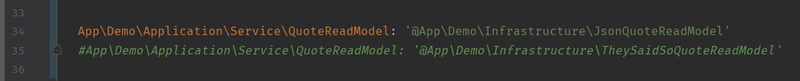

# Demo 2

Done with Symfony 5.1 and Docker

## Getting Started

### Getting ready for development

If it is the first time, you should run
```bash
docker-compose build
```

Once is built you can execute de project with
```sh
docker-compose up
```

You will need to enter in to the machine to execute tests or execute commands
```sh
docker exec -it bash demo
```


#### Reading the shouts

By default is reading the file `src/Demo/_assets/quotes.json` that is the file provided by the exercise. If you want to read the quotes using TheySaidDo API:

1. Edit file `src/Demo/_config/services.yaml`

2. Comment the injection of the service `JsonQuoteReadModel` (line 34), and uncomment the service `TheySaidSoQuoteReadModel` (line 35)


3. In `.env` file configure `THEY_SAID_SO_API_KEY` setting your TheySaidSo API key
> Depending on the subscription you choose, the service will only provide 1 quote even if you ask for more

### Running tests and validating the code

* Phpunit: `vendor/bin/phpunit` 
* Paratest: `vendor/bin/paratest`(with the amount of tests, the parallelization won't be a big optimization versus phpunit)
* Phpcs: `vendor/bin/phpcs src`
* Phpstan: `vendor/bin/phpstan analyse src --level=8`

### Other commands

+ `bin/console demo:cache:empty` -> It will clear the shouts cache
+ `bin/console demo:shout:list` -> the same as the request but using the console, it has the same features


## Some decisions about the exercise

### Architecture

I created the bounded context Demo, where is all the logic around shouts, the reason is to allow the project be able to increase it's functionalities in an horizontal way. Then once is created a bounded context `Kernel.php` will detect that and search if have `_config` and `_routes` folder to configure. This will help that I can delete an entire bounded context without modifying any configuration of the project. I like to use the Symfony config folder just to configure framework related stuff, and each bounded context should be able to configure itself.

I could create a core/common bounded context for implement services that are generic like the cache or the bus, but I tried to keep a balance between this being simple and being modular.

### Cache

The reason I used `FylesystemCache` instead of others like Redis is to no overcomplicate the exercise, but to implement a cache that works with Redis is as easy to implement `App\Demo\Application\Service\Cache` interface and add it to the configuration file of the bounded context.

The cache is used inside de Bus, this is because I was analysing several places were I could use the cache:

* **Query Handler**: I rejected that option because for every query I would have to implement the cache, I preferred something more automated, but if I wanted to do something more specific you can still inject the cache in a Query Handler
* **Read Model**: Similar to the Query Handler, if for some reason the project needs a new Read Model, I would have to remember to use a cache, and if somebody forgets to do that it could cause a great damage, but as it happens in the Query Handler, the cache can be injected
* **Controller/Console Command** : The same, I do not want to the developer to focus on some trivial things when doing the tasks, when less have to do, less probability to create bugs.
* **Bus**: This is were I implemented the usage of the cache, the reason is that for every query will be send throw a Bus, then I can store the query before the serialization (but only if the query implements `CacheableQuery`), then the same request independently if it is a JSON or XML, it will store a document, then when there is a hit on the cache, the only that is left is transform the data in to the requested format.


#### 	Why not Varnish?

I don't have to much knowledge about varnish, but I used that, and appears a functionality that wants to limit de amount of shouts a user can access by hour and get some metrics about which shouts has appeared more, it would be tedious to do, without varnish and using the actual cache I can implement a middleware or something else to do that. It is just a trade of, if used Varnish the response will be much faster.


### Bus

I Implemented a custom Bus that uses the `symfony/messenger` to be able to add the cache, I tried to add the cache as a middleware, but I wasn't able to do that, but all the `symfony/messenger` features are still working.

When a dispatch a query it returns a `Document` object, the reason is that usually queries returns an array of  random data, but I prefer to use typed data, the responsibility of the document is to be able to give the raw data to create the response using the method `serialize`, this allow for example the Controller to transform this automatically in whichever format (JSON, XML, ...)


### Controller

The controller transforms de Document in to the desired format, I cannot fully automate that part, but here the controller makes a simple generic validation of the request (i.e validates the limit is an integer, later the Domain will be validate that the range is valid). I also added several response format:

* **JSON**:  Is the requested format in this exercise
* **XML**: Just to add another common format
* **CSV/YAML**: I just added those two just for fun

Also when the response is an error (HTTP 404 or other) it will be returned too in the requested format


> To see the error in CSV format you need to use software like Postman, because the browser tries to download a file, but it won't do it because the response has an error code.

> To see the csv error is preferred to use the prod environment if working in local, I allow CSV just for fun.

> When in development or test the response will contain extra information.

> In production when the response is 5XX the message will be replaced by `Internal Server Error`


### Improvements

* Validate the CSV, XML and YAML format in the responses.
* Transform the cache layer in the bus into a proper middleware.
* Implement the `RedisCache` (`FilesystemCache` is emptied once the project is deployed).
* Implement a `ShoutReadModel` that uses the two other shout read model for fun.

* I have added `Infection` for mutation testing, but it needs to be configured.

* Make easier to change between both `ShoutReadModel`
* CORS configuration is very simple


## Extras

* I Have added the file `Demo.postman_collection.json`, this is a Postman's collection
* I Have added the file `Demo.swagger.yaml`
* I Have added the integration with Github and deployed to Heroku (it will be easier to see when the cache is working)
